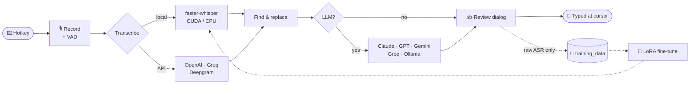

<div align="center">


<a href="#-quick-start">
  
</a>

<p>
  
  
  
  
  
</p>
<p>
  
  
  
</p>
<p>
  <a href="https://ko-fi.com/albert828"></a>
</p>


<sub><b>
<a href="#-features">Features</a> ·
<a href="#-how-it-works">How it works</a> ·
<a href="#-quick-start">Quick start</a> ·
<a href="#-documentation">Docs</a> ·
<a href="#-credits">Credits</a>
</b></sub>

</div>

<br>

## ✨ Features

<table>
<tr>
<td width="50%" valign="top">

### 🎙️ Dictate anywhere
Press a hotkey, speak, and the text is typed at your cursor in any app. Four modes are available: **toggle**, **hold**, **voice-activity** and **continuous**.

</td>
<td width="50%" valign="top">

### ⚡ Ready in ~6 s
Startup takes about 6 s, down from ~29 s. Imports and the settings window load only when first needed, and the app venv has no torch. The CUDA 12 toolkit is found automatically.

</td>
</tr>
<tr>
<td valign="top">

### 🧠 LLM superpowers
- **Cleanup** mode fixes grammar and filler words.
- **Instruction** mode turns what you say into a prompt.
- **Rewrite** mode cleans up copied text and pastes it back in place.

Supported providers: Claude, ChatGPT, Gemini, Groq and Ollama.

</td>
<td valign="top">

### ✍️ Review before paste
Check and fix the transcript before it is typed. Built for **collecting clean training data**: whatever you correct is saved as the label next to the audio.
Listen back while you edit: **play / pause**, **seek ±N s** and a **scrub slider** take you to the exact word you misspoke.
<kbd>Enter</kbd> accept · <kbd>Esc</kbd> cancel · <kbd>Ctrl</kbd>+<kbd>Space</kbd> play

</td>
</tr>
<tr>
<td valign="top">

### 💾 Your voice → dataset
Every dictation can be saved as FLAC plus `metadata.jsonl` in the Hugging Face `audiofolder` format. Text you corrected in the review dialog is saved as the label.

</td>
<td valign="top">

### 🎯 Fine-tune on yourself
A LoRA subproject fine-tunes `whisper-large-v3-turbo` on your own dataset and exports the result to CTranslate2. Loading it takes one line of config.

</td>
</tr>
</table>

<div align="center">

<br><sub>Redesigned settings, one tab per config section</sub>
</div>

## 🔄 How it works



## 🚀 Quick start

```powershell
git clone https://github.com/albertlis/open-writer-2.0.git
cd open-writer-2.0
uv sync --extra local
.\start.bat            # or: uv run python run.py
```

The first launch opens **Settings**. Pick a model, set a hotkey (default <kbd>Ctrl</kbd>+<kbd>Shift</kbd>+<kbd>Space</kbd>) and save. After that the app lives in the system tray.

<details>
<summary><b>⌨️ Default hotkeys & modes</b></summary>

| Hotkey | Does |
|---|---|
| `activation_key` | Record → transcribe → type |
| `llm_cleanup_key` | … → LLM cleanup → type |
| `llm_instruction_key` | … → LLM follows your spoken instruction |
| `text_cleanup_key` | Clipboard text → LLM → replaces the selection |

The recording modes are `press_to_toggle`, `hold_to_record`, `voice_activity_detection` and `continuous`. More in [Usage](docs/usage.md).
</details>

<details>
<summary><b>🆚 What this fork adds over upstream</b></summary>

| | Upstream | This fork |
|---|:---:|:---:|
| Time to ready | ~29 s | **~6 s** |
| Status UI | basic window | pill with live level meter + timer |
| Review & edit before typing | ❌ | ✅ with audio playback |
| Training data capture | ❌ | ✅ FLAC + JSONL |
| Whisper fine-tuning | ❌ | ✅ LoRA → CTranslate2 |

</details>

## 📚 Documentation

| | Guide | What's inside |
|:-:|---|---|
| 📦 | [Installation](docs/installation.md) | Prerequisites, `uv`, CUDA discovery, `start.bat` |
| 🎛️ | [Usage](docs/usage.md) | Hotkeys, recording modes, status pill, review dialog |
| ⚙️ | [Configuration](docs/configuration.md) | Every option in `config_schema.yaml`, keyring entries |
| ☁️ | [Providers](docs/providers.md) | Local and API transcription, LLM providers |
| 🧹 | [Post-processing](docs/post-processing.md) | Find & replace, LLM modes, output methods |
| 💾 | [Training data](docs/training-data.md) | Dataset format, fine-tuning workflow |
| 🩺 | [Troubleshooting](docs/troubleshooting.md) | Known issues and fixes |
| 📝 | [Changelog](CHANGELOG.md) | What changed and when |

## 💜 Credits

This is a fork of a fork. It stands on the shoulders of:

- **[savbell/whisper-writer](https://github.com/savbell/whisper-writer)** is the original WhisperWriter by [@savbell](https://github.com/savbell) and [contributors](https://github.com/savbell/whisper-writer/graphs/contributors).
- **[Thomas Frank](https://github.com/TomFrankly)** made the Windows-focused fork with LLM post-processing.
- [OpenAI Whisper](https://github.com/openai/whisper) · [faster-whisper](https://github.com/SYSTRAN/faster-whisper) · [CTranslate2](https://github.com/OpenNMT/CTranslate2)

## 📄 License

[GNU GPL v3](LICENSE). Free as in freedom.


