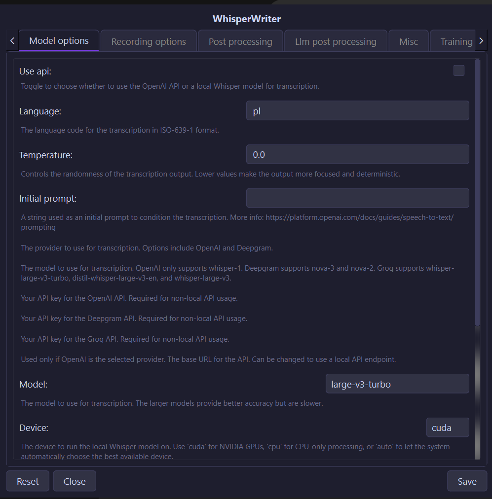

# Usage

## Starting the app

Launch via `start.bat` (double-click) or `uv run python run.py` from the repo root. Startup takes ~6 s on first load.

WhisperWriter runs entirely from the **system tray** — there is no main window. Right-click the tray icon for:

- **Settings** — opens the Settings window
- **Exit** — shuts down the app

## Status pill

A frameless 44 px dark pill appears at the bottom centre of the screen (48 px above the taskbar) when a recording or transcription is active. It shows:

- **Elapsed time** — how long the current recording has been running
- **9-bar mic level meter** — live input level
- **Busy animation** — slow travelling wave while transcribing

Hide the pill permanently via `misc` → `hide_status_window` in Settings.

## Hotkeys

Four independent hotkeys, all configurable in **Recording options**:

| Config key | Default | Behaviour |
|------------|---------|-----------|
| `activation_key` | `ctrl+shift+space` | Record → transcribe → type at cursor |
| `llm_cleanup_key` | *(none)* | Record → transcribe → LLM cleanup prompt → type |
| `llm_instruction_key` | *(none)* | Record → transcribe → LLM instruction prompt → type |
| `text_cleanup_key` | *(none)* | Clipboard text → LLM cleanup → delete selection + paste result. **Copy (`Ctrl+C`) the selection first** — the app does not copy it for you |

Keys use `+`-separated names, e.g. `ctrl+alt+numpad1`.

## Recording modes

Set in **Recording options** → `recording_mode`:

| Mode | Behaviour |
|------|-----------|
| `press_to_toggle` *(default)* | First press starts; second press stops and transcribes |
| `hold_to_record` | Records while the key is held; releases trigger transcription |
| `voice_activity_detection` | Stops automatically after a silence (`silence_duration` ms) |
| `continuous` | Records → transcribes → re-arms until `continuous_timeout` seconds of silence, then stops; requires explicit opt-in (`allow_continuous_api`) when using remote APIs |

## Settings window

Open from the tray icon. Tabs:



### Model options

- **Use API** — toggle between local Whisper/Vosk and a remote transcription API
- **Language** — ISO 639-1 code (e.g. `en`, `pl`); leave blank for auto-detect
- **Temperature** — 0.0 = deterministic; higher = more varied output
- **Initial prompt** — seed text to bias vocabulary (use sparingly; a comma-separated word list degrades quality)
- **Model** — local: `large-v3-turbo`, `distil-large-v3`, `base`, `tiny`, etc.; API: provider-specific
- **Device** — `cuda` (NVIDIA GPU), `cpu`, or `auto`

### Recording options

Configure hotkeys, recording mode, sound device, sample rate, silence duration, and minimum recording length.

### Post-processing

- **Find & replace file** — path to a `.txt` (simple `find,replace` pairs) or `.json` (regex + capture-group transforms) rules file
- **Clipboard threshold** — character count above which text is pasted instead of typed (default 1000); clipboard contents are restored after paste
- **Trailing space / period / capitalisation** — text normalisation toggles

See [docs/configuration.md](configuration.md) for the full option reference.

### LLM post processing

Enable LLM processing and configure:

- Provider: `chatgpt`, `claude`, `gemini`, `groq`, `ollama`
- Cleanup model and instruction model (can differ)
- System prompts for each hotkey slot
- Optional extended system prompt files (`.txt` appended to the prompt)

See [docs/providers.md](providers.md) for supported model names per provider.

### Misc

- `hide_status_window` — hide the recording pill
- `noise_on_completion` — play a beep when typing finishes
- `pause_media_while_recording` — pause system audio while recording
- `print_to_terminal` — log transcribed text to the console

## Review dialog

Enable in **Training** settings (`training_data` → `review_before_paste`). After transcription, a dialog appears with the transcript text before it is typed.

| Key | Action |
|-----|--------|
| Enter | Accept and type the text |
| Shift+Enter | Insert a newline in the editor |
| Esc | Cancel — nothing is typed and nothing is saved |
| Ctrl+Space | Play / pause audio playback |

The dialog also provides a playback slider, seek buttons (±`review_seek_seconds`, default 5 s), and a time label. Text is editable before accepting.

## Find and replace

### Text mode (`.txt`)

One `find,replace` pair per line:

```
soda,coke
gonna,going to
```

### JSON mode (`.json`)

Supports regular expressions and capture-group transforms:

```json
[
  {
    "type": "regex",
    "find": "quote,?\\s+(.+?)\\s+end\\s*quote,?",
    "replace": "\"$1\"",
    "transforms": [{"group": 1, "operations": ["capitalize"]}]
  }
]
```

Available transforms: `capitalize`, `upper`, `lower`, `strip`, `title`.

## Training data

See [docs/training-data.md](training-data.md) for recording collection and the fine-tuning subproject (`training/`).

## Known issues

- **LLM instruction routing** — when `instruction_system_message_file_path` is set, the model selection logic may fall back to the cleanup model silently. Verify the correct model is being used if results seem wrong.
